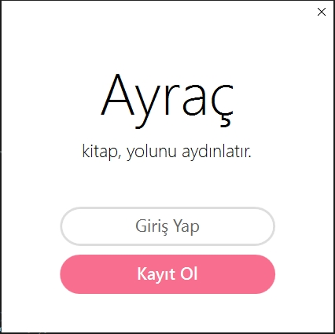

# Yazlab1

## BOOKMARK
 

### What's Bookmark?

Bookmark is a desktop application which lets you read e-books with high accuracy recommendation system.

### Pros

- Friendly UI
- Multithreading
- Uses Cosine Similarity

### Login Screen

### Authors

 - [Oguzhan Turker](https://github.com/oguzturker8/)
 - [Ata Gulalan](https://github.com/atagulalan/)
